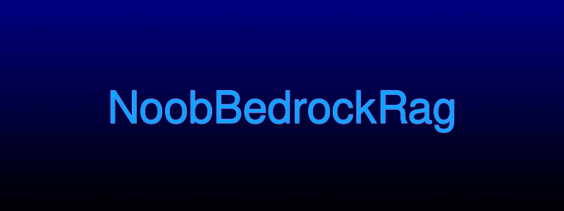
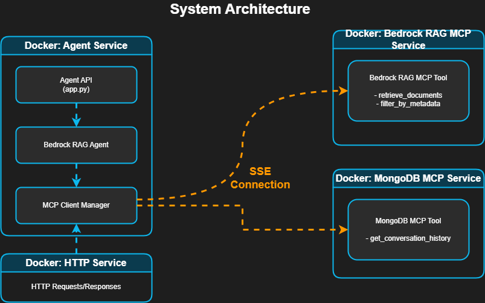

# Bedrock RAG System

[](https://www.python.org)
[](https://aws.amazon.com/bedrock/)
[](https://www.langchain.com/)
[](https://www.docker.com/)
[](#mcp-architecture-overview)
[](LICENSE)
[](#)
[](https://www.jenkins.io/)
[](https://github.com/SuyodhanJ6/bedrockNoobPOC.git)

A specialized system that leverages AWS Bedrock for Retrieval-Augmented Generation (RAG). The system provides a microservices architecture for retrieving relevant documents from AWS Bedrock knowledge bases and answering user queries with citations and context.

<div align="center">
  
</div>

## System Architecture

The following diagram illustrates the system setup:



This project follows the Model Context Protocol (MCP) architecture, which separates the agent logic from the tool implementations. The system consists of:

1. **MCP Servers**: Microservices that host tools and provide specific functionality
2. **Agent**: A client that connects to the MCP servers and uses their tools

This diagram shows:
- The **Agent Service** running the main application, including the API endpoint, the core RAG agent logic, and the MCP client manager.
- The **Bedrock RAG MCP Service** hosting the tools for interacting with AWS Bedrock.
- The **MongoDB MCP Service** hosting the tools for managing conversation history.
- The Agent's MCP Client Manager connects to both MCP servers via SSE (Server-Sent Events) connections.
- User requests come in via HTTP to the Agent API, and responses are sent back.

### MCP Architecture Overview

The MCP architecture allows for a modular design where:
- Tools and domain-specific functionality are hosted on dedicated servers
- Agents can connect to these servers via SSE (Server-Sent Events)
- Communication follows the MCP protocol, enabling interoperability

## Components

### MCP Servers

1. **Bedrock RAG MCP Server (`mcp_servers/bedrock_rag/`)**
   - Provides document retrieval services via Amazon Bedrock
   - Implements tools for retrieving and filtering documents
   - Currently implements:
     - `retrieve_documents`: Retrieves documents relevant to a query
     - `filter_by_metadata`: Filters documents by metadata field values
   - Runs on port 3003 by default

2. **MongoDB MCP Server (`mcp_servers/mongodb/`)**
   - Provides conversation history storage and retrieval services
   - Implements tools for accessing conversation history
   - Currently implements:
     - `get_conversation_history`: Retrieves conversation history for a specified ID
   - Runs on port 3004 by default

### Agent

1. **Bedrock RAG Agent (`agent/agent.py`)**
   - Main agent that answers questions using AWS Bedrock RAG capabilities
   - Uses LangChain and LangGraph to create a ReAct agent
   - Connects to the Bedrock RAG and MongoDB MCP servers
   - Handles conversation context and memory

2. **MCP Client Manager (`agent/mcp_client.py`)**
   - Handles connections to MCP servers
   - Collects tools from all servers for the agent to use

3. **Agent API Server (`agent/app.py`)**
   - Provides RESTful API for interacting with the agent
   - Handles HTTP requests and returns responses
   - Includes performance monitoring middleware

### Configuration

1. **Config Module (`agent/config/config.py`)**
   - Centralizes configuration settings loaded from environment variables
   - Provides sections for AWS credentials, Bedrock settings, MCP servers, etc.
   - Supports development and production environments

## How It Works

1. The MCP servers are started first, exposing their tools via SSE endpoints
2. The agent connects to these servers through the MCP Client Manager
3. When given a user query:
   - The agent determines if context from conversation history is needed using MongoDB MCP
   - The agent then uses the Bedrock RAG MCP to retrieve relevant documents
   - The retrieved documents are used to generate an informed answer
   - The conversation is saved to MongoDB for future context

## Getting Started

### Prerequisites

- Python 3.11
- Docker and Docker Compose
- AWS Account with access to Bedrock services
- MongoDB instance

### Setup

1. Clone the repository:
   ```
   git clone https://github.com/SuyodhanJ6/bedrockNoobPOC.git
   cd bedrockNoobPOC
   ```

2. Configure environment variables for each component according to their individual README files.

3. Use the following make commands to build and run the system:

   ```bash
   # Build all containers
   make build
   
   # Start all services in detached mode
   make up
   
   # Start specific services
   make start-agent         # Start only the agent service
   make start-bedrock-rag   # Start only the Bedrock RAG MCP service
   make start-mongodb       # Start only the MongoDB MCP service
   
   # View logs
   make logs                # View all logs
   make logs-agent          # View agent logs
   make logs-bedrock-rag    # View Bedrock RAG MCP logs
   make logs-mongodb        # View MongoDB MCP logs
   
   # Stop services
   make down                # Stop all services
   
   # Clean up
   make clean               # Remove all containers and volumes
   
   # Run tests
   make test                # Run all tests
   ```

4. Start the system with Docker Compose if you don't want to use make:
   ```
   docker-compose up --build
   ```

## Docker Deployment

The repository includes Dockerfiles for all components, allowing for containerized deployment.

To build and run with Docker Compose:

```
docker-compose up --build
```

This will start all services defined in the docker-compose.yml file:
- Agent API server on port 8000
- Bedrock RAG MCP server on port 3003
- MongoDB MCP server on port 3004

### Accessing the API

Once the system is running, you can generate answers by sending a POST request to:
```
http://localhost:8000/v1/query
```

With a JSON body like:
```json
{
  "query": "What is AWS Bedrock?",
  "conversation_id": "optional-conversation-id"
}
```

## CI/CD with Jenkins

This project includes a Jenkins CI/CD pipeline for automated building, testing, and deployment. The CI/CD configuration can be found in the following files:

- **Jenkinsfile** - Contains the complete pipeline definition with all stages
- **docker-compose.yml** - The final Docker Compose configuration used by Jenkins for deployment
- **.jenkins/** directory - Contains documentation and credentials information

### Overview

This project uses Jenkins for continuous integration and deployment. The implementation is available in the `jenkins-v0.1` branch, which contains all the necessary configuration files for the CI/CD pipeline.

### Key Files

- **Jenkinsfile** - The final version of the Jenkins pipeline definition that automates the build, test, and deployment process
- **docker-compose.yml** - The final Docker Compose configuration used for deployment
- **.jenkins/** - Directory containing documentation about the pipeline:
  - **.jenkins/README.md** - Documentation on the pipeline configuration
  - **.jenkins/CREDENTIALS.md** - Details on the required credentials

### Getting Started with Jenkins CI/CD

1. Clone the repository and checkout the jenkins-v0.1 branch:
   ```bash
   git clone https://github.com/SuyodhanJ6/bedrockNoobPOC.git
   cd bedrockNoobPOC
   git checkout jenkins-v0.1
   ```

2. Set up Jenkins following the installation instructions below

3. Configure the Jenkins credentials as described in .jenkins/CREDENTIALS.md

4. Create a new Jenkins pipeline job pointing to the repository and the Jenkinsfile

### Pipeline Workflow

The CI/CD pipeline automatically:
- Builds Docker images for all services
- Runs tests to ensure code quality
- Pushes images to ECR repository (main branch only)
- Deploys to development environment (develop branch)
- Deploys to production with manual approval (main branch)

For detailed information about the pipeline stages and configuration, see the [.jenkins/README.md](.jenkins/README.md) file.

### Jenkins Installation

To set up Jenkins for the CI/CD pipeline:

1. Install Jenkins on an Ubuntu server:

   ```bash
   # Add the Jenkins repository key
   sudo wget -O /usr/share/keyrings/jenkins-keyring.asc \
       https://pkg.jenkins.io/debian-stable/jenkins.io-2023.key
   
   # Add the Jenkins repository
   echo deb [signed-by=/usr/share/keyrings/jenkins-keyring.asc] \
       https://pkg.jenkins.io/debian-stable binary/ | sudo tee \
       /etc/apt/sources.list.d/jenkins.list > /dev/null
   
   # Install Java and Jenkins
   sudo apt-get update -y && sudo apt-get install fontconfig openjdk-17-jre -y && sudo apt-get install jenkins -y
   
   # Start and enable Jenkins
   sudo systemctl start jenkins
   sudo systemctl enable jenkins
   
   # Check Jenkins status
   sudo systemctl status jenkins
   ```

2. Install Docker for Jenkins:

   ```bash
   # Install Docker
   curl -fsSL https://get.docker.com -o get-docker.sh
   sudo sh get-docker.sh
   
   # Add your user to the Docker group
   sudo usermod -aG docker $USER
   
   # Add Jenkins user to the Docker group
   sudo usermod -aG docker jenkins
   
   # Restart Jenkins
   sudo systemctl restart jenkins
   
   # Apply new group membership
   newgrp docker
   
   # Ensure Docker socket is accessible
   sudo chmod 666 /var/run/docker.sock
   ```

3. Get the initial Jenkins admin password:

   ```bash
   sudo cat /var/lib/jenkins/secrets/initialAdminPassword
   ```

4. Open Jenkins in your browser at http://your-server-ip:8080 and complete the setup.

5. Install the required Jenkins plugins:
   - Docker Pipeline
   - AWS Steps
   - Credentials Binding
   - Pipeline Utility Steps
   - Timestamper
   - SSH Agent
   - GitLab Integration

6. Configure the Jenkins credentials as described in [.jenkins/CREDENTIALS.md](.jenkins/CREDENTIALS.md).

## License

[MIT](LICENSE)